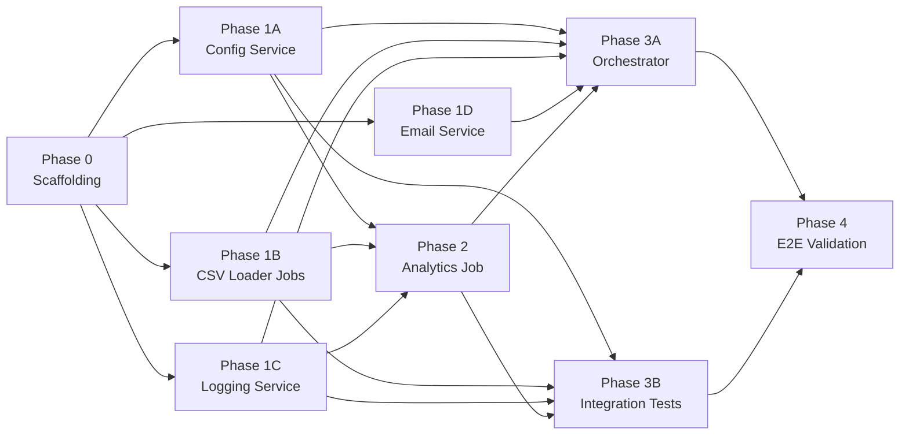

# Migration Playbook: Talend 7.2.1 to Spring Boot 3.x

## Overview

This playbook defines the phased migration of the **TALEND_AWS_DI_USECASE** ETL project from Talend Data Integration 7.2.1 to a modern **Spring Boot 3.x** application running on **Java 17**. The migration preserves the original business logic — CSV ingestion, relational joins, analytics aggregation, logging, and email notifications — while replacing the Talend runtime with idiomatic Spring components.

The plan is organized into **5 phases across 9 parallel-capable sessions**. Each session file under `playbook/` is a self-contained prompt that can be pasted directly into a Devin agent session.

## Target Tech Stack

| Component | Technology |
|-----------|-----------|
| Framework | Spring Boot 3.x |
| Language | Java 17 |
| Build | Maven |
| Database (prod) | MySQL 8 |
| Database (test) | H2 (MySQL compatibility mode) |
| Containerization | Docker / Docker Compose |

## Source Reference

- **Talend source files**: `TALEND_AWS_DI_USECASE/` (jobs in `process/`, reusable joblets in `joblets/`)
- **Seed data**: `seed_data/` (CSV files, SQL scripts, environment config)
- **Original README**: `README.md` (architecture diagrams and component descriptions)

## Dependency Graph

## Session Index

| # | Session ID | Title | File | Prerequisites | Parallel Group | Status |
|---|-----------|-------|------|---------------|----------------|--------|
| 1 | phase-0 | Project Scaffolding | [`playbook/phase-0-scaffolding.md`](playbook/phase-0-scaffolding.md) | None | — | [x] |
| 2 | phase-1a | Config / Context Service | [`playbook/phase-1a-config-service.md`](playbook/phase-1a-config-service.md) | phase-0 | Group 1 | [ ] |
| 3 | phase-1b | CSV Loader Jobs | [`playbook/phase-1b-csv-loader-jobs.md`](playbook/phase-1b-csv-loader-jobs.md) | phase-0 | Group 1 | [ ] |
| 4 | phase-1c | Logging Service | [`playbook/phase-1c-logging-service.md`](playbook/phase-1c-logging-service.md) | phase-0 | Group 1 | [ ] |
| 5 | phase-1d | Email Service | [`playbook/phase-1d-email-service.md`](playbook/phase-1d-email-service.md) | phase-0 | Group 1 | [ ] |
| 6 | phase-2 | Analytics Summary Job | [`playbook/phase-2-analytics-job.md`](playbook/phase-2-analytics-job.md) | phase-1a, phase-1b, phase-1c | Group 2 | [ ] |
| 7 | phase-3a | Orchestrator & Docker | [`playbook/phase-3a-orchestrator.md`](playbook/phase-3a-orchestrator.md) | All Phase 1 + Phase 2 | Group 3 | [ ] |
| 8 | phase-3b | Integration Tests | [`playbook/phase-3b-integration-tests.md`](playbook/phase-3b-integration-tests.md) | All Phase 1 + Phase 2 | Group 3 | [ ] |
| 9 | phase-4 | End-to-End Validation | [`playbook/phase-4-e2e-validation.md`](playbook/phase-4-e2e-validation.md) | All previous phases | — | [ ] |

## How to Use

### Execution Model

1. **Run Phase 0 first** — it creates the Maven project skeleton that all other sessions depend on.
2. **Run Phase 1A–1D in parallel** — these four sessions are fully independent of each other. Each implements a distinct service against the shared `Job` interface and project structure from Phase 0.
3. **Run Phase 2 after 1A, 1B, and 1C complete** — the analytics job depends on the config service, CSV loader, and logging service.
4. **Run Phase 3A and 3B in parallel after Phase 2 completes** — the orchestrator and integration tests can be developed simultaneously.
5. **Run Phase 4 last** — end-to-end validation requires all code to be merged.

### Using with Devin

Each `playbook/phase-*.md` file is a **self-contained prompt**. To execute a session:

1. Open a new Devin session pointed at this repository (`codev-workshops/talend-sample-3`, branch: `master`).
2. Copy-paste the entire contents of the relevant phase file as the prompt.
3. The agent will have all the context it needs — no prior conversation history is required.
4. After the session completes and its PR is merged, proceed to the next phase(s) in the dependency graph.

### Tracking Progress

Use the checkboxes in the Session Index table above to track which phases are complete. Update this file as PRs are merged.
