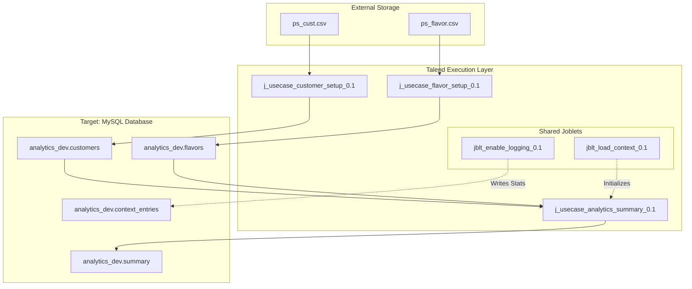
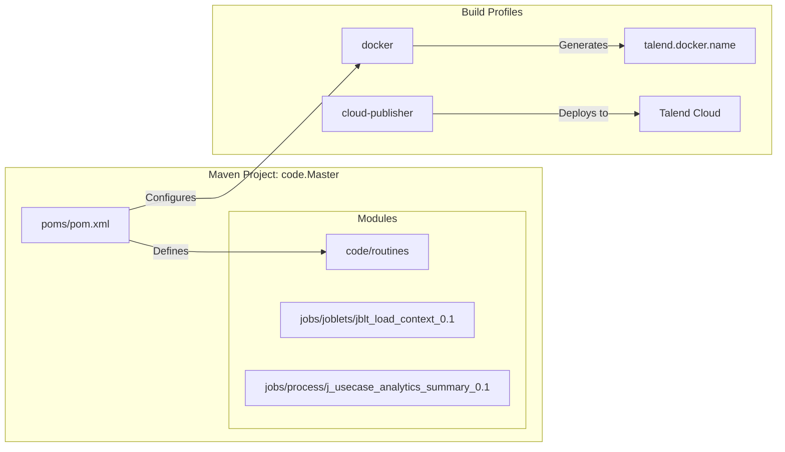

# TALEND_AWS_DI_USECASE

The **TALEND_AWS_DI_USECASE** project is a Talend Data Integration (DI) implementation designed to demonstrate a complete ETL (Extract, Transform, Load) lifecycle within an AWS-centric ecosystem. The project focuses on ingesting raw flat-file data (Customers and Flavors), performing relational joins and aggregations, and persisting the results into a MySQL data store.

The project emphasizes reusability through the use of **Joblets** for cross-cutting concerns such as environment-specific context loading and centralized logging.

### Technology Stack
- **ETL Engine**: Talend Data Fabric 7.2.1
- **Language**: Java 1.8
- **Build System**: Maven with specialized Talend CI plugins
- **Database**: MySQL (Target for analytics and logging)
- **Deployment**: Docker (OpenJDK 8 base) and Talend Cloud

---

### Core Components and Workflow

The system is organized into three primary executable jobs supported by a library of reusable joblets.

#### 1. Data Ingestion & Transformation
- **Setup Jobs**: `j_usecase_customer_setup` and `j_usecase_flavor_setup` ingest pipe-delimited CSV files into MySQL.
- **Analytics Job**: `j_usecase_analytics_summary` performs a join between customer and flavor data to produce state-level flavor preferences.

#### 2. Reusable Joblets
- **Context Loading**: Multi-phase initialization (Global -> Env-Specific -> Job-Specific).
- **Operations**: Standardized logging and status notifications.

### System Architecture Diagram

### Build Entity Mapping

---

### Project Layout

- **Process**: Contains the `.item` and `.properties` files for ETL jobs.
- **Joblets**: Contains reusable component logic.
- **Poms**: Orchestrates the build process, including Docker image creation via the `fabric8-maven-plugin`.
- **pyspark_jobs/**: PySpark conversions of Talend jobs with local MySQL testing infrastructure. See [`pyspark_jobs/README.md`](pyspark_jobs/README.md) for details.
